# nlp-traininglabs

# Environment Setup Guides
There are few important steps in setting up your environment:

## Step 1: Install Anaconda

1. Go to [Anaconda Official Website](https://www.anaconda.com/products/individual) and download the latest **Anaconda Individual Edition** installer with **Python 3.x**.
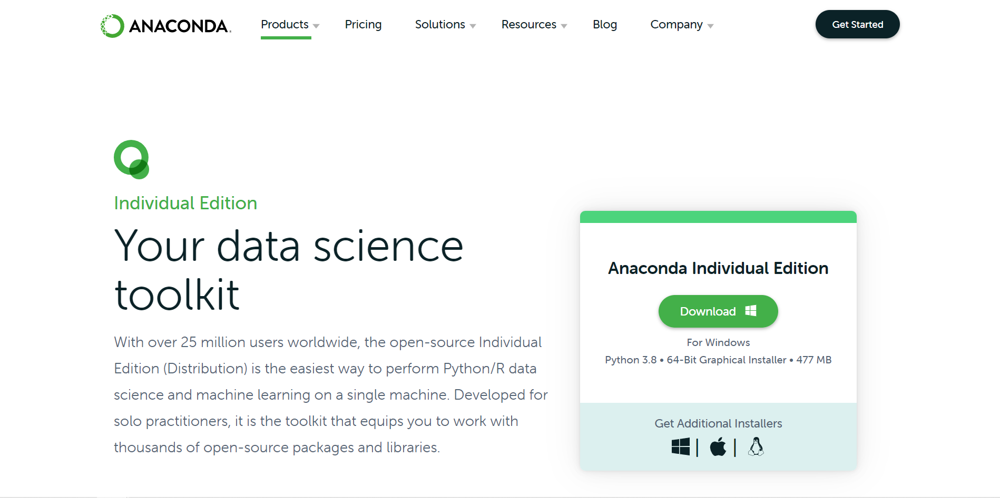

2. Open the installer and follow all the setup instruction.
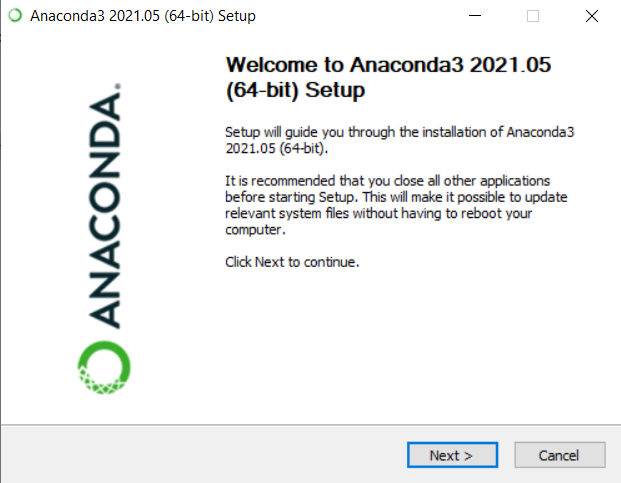

3. For more setup information, please refer to [Anaconda Setup Guideline](https://docs.anaconda.com/anaconda/install/windows/).
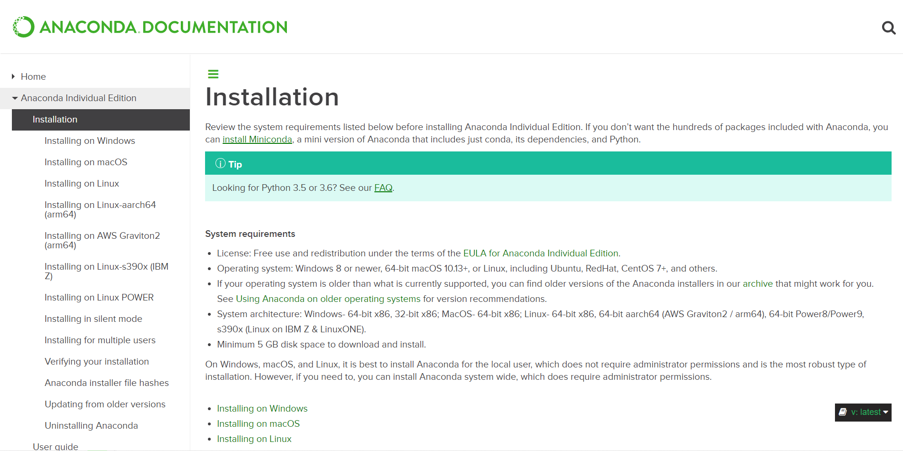

 

## Step 2: Clone nlp-traininglabs Repository

- **If you have git installed**:
1. Navigate to the folder where you want to keep the `traininglabs`.

2. Press `shift` + `right click` and select `Git Bash here`.
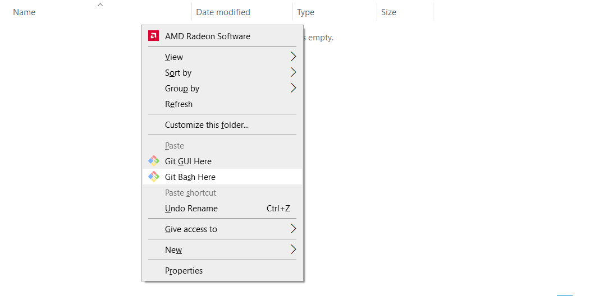

3. Enter the following command to clone `nlp-traininglabs` to your local drive.

    > git clone https://github.com/skymind-talent/nlp-traininglabs.git

 

- **If you do not have git installed**
1. Go the [nlp-traininglabs](https://github.com/skymind-talent/nlp-traininglabs) github repository.
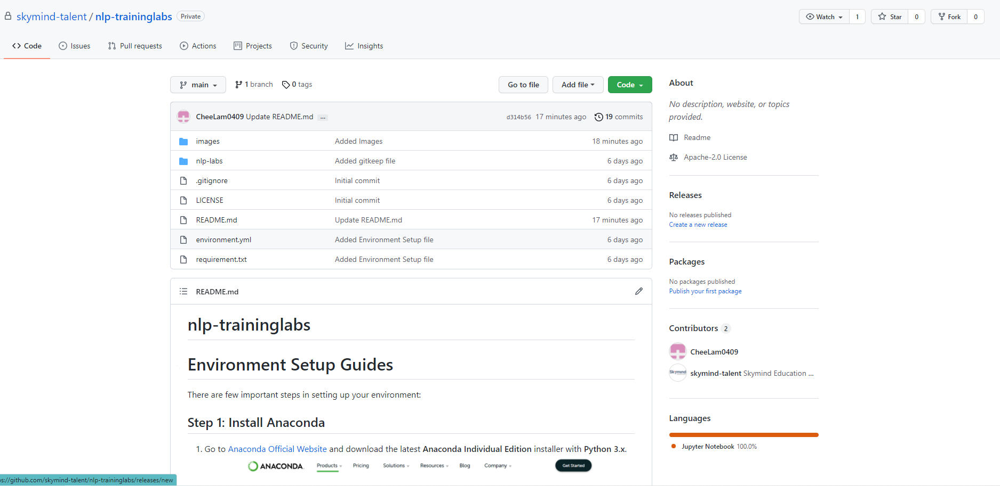

2. Download the repository as zip file.
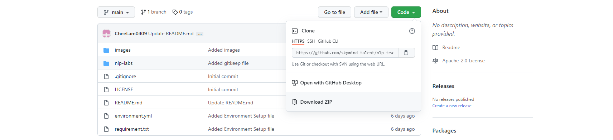

3. Unzip the file to the folder where you want to keep the `traininglabs`.

 

## Step 3: Install NLP-Labs Dependencies

1. Open Anaconda Prompt.
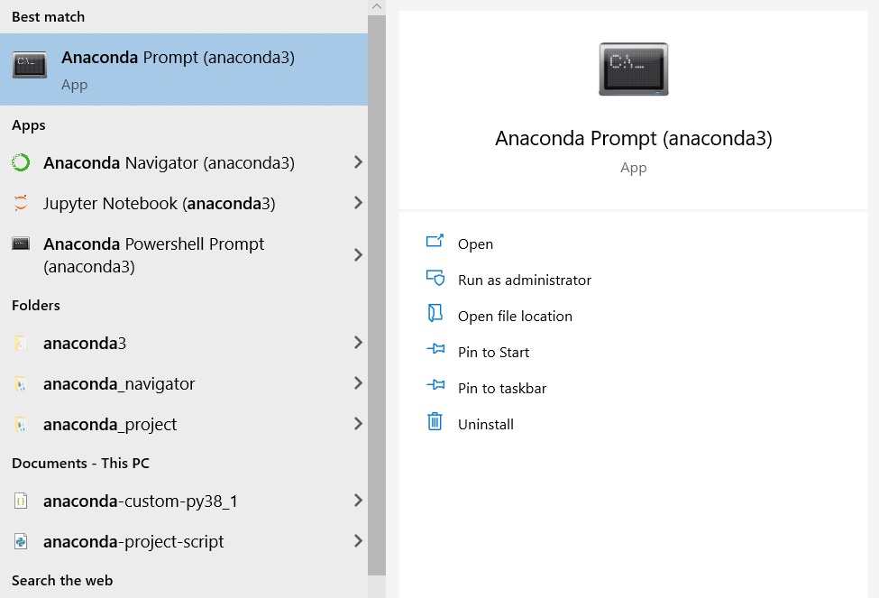

2. Navigate to your NLP-Labs root folder, e.g:
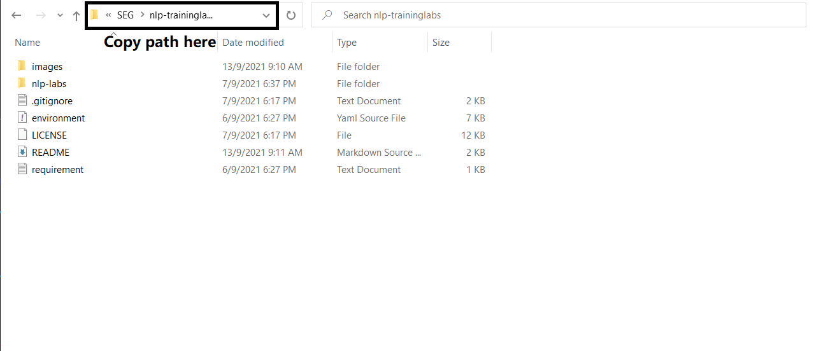
    > `cd {enter your path here}\nlp-traininglabs`

3. Run the following command to create new conda environment: 
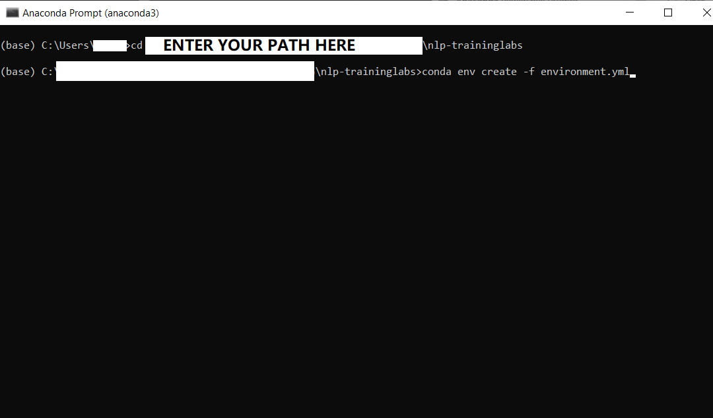
    > `conda env create -f environment.yml`

4. Press y to confirm installation.

5. Your installation should be completed.

6. Activate `nlp-labs` environment:
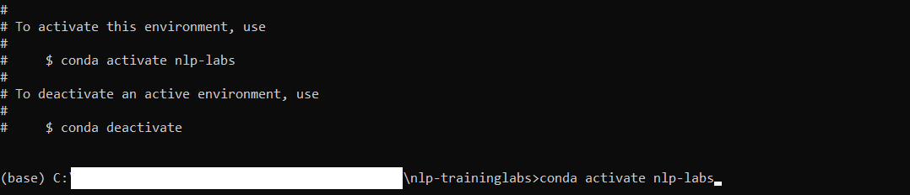
    > `conda activate nlp-labs`

 

## Step 4: Install Python Packages

1. Open Anaconda Prompt and activate nlp-labs environment.

2. Navigate to NLP-Labs root folder:

3. Run the following command to install required modules for this training lab:
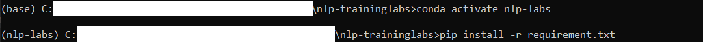
    > `pip install -r requirement.txt`

4. Wait for the download and installation to complete.
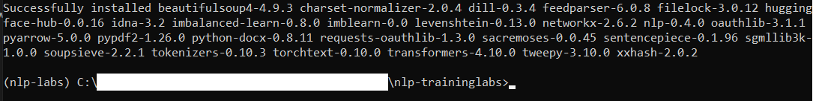

 

## Step 5: Install Spacy Language Models

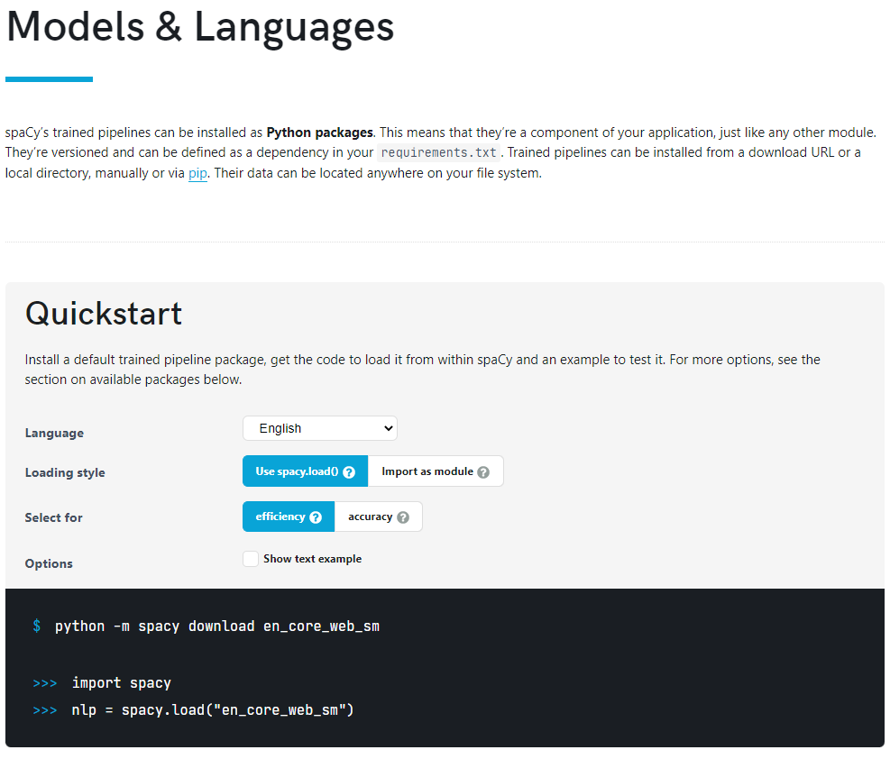

Throughout this training labs, we will mainly using these language models:

- en_core_web_sm

- de_core_news_sm

- en_core_web_lg

- fr_core_news_lg

To install these modules, run the following commands:

    > python -m spacy download en_core_web_sm

    > python -m spacy download de_core_news_sm

    > python -m spacy download en_core_web_lg

    > python -m spacy download fr_core_news_lg

For more SpaCy language models installation guidelines, please refer to [SpaCy Models & Languages](https://spacy.io/usage/models).

 

## Step 6: Download NLP-training Labs Resources

1. Go to the [resources folder](https://drive.google.com/drive/folders/1_JV6NpYNvKjvfD4yHqO2mKvsrRYUCj3I?usp=sharing) located at Google Drive.
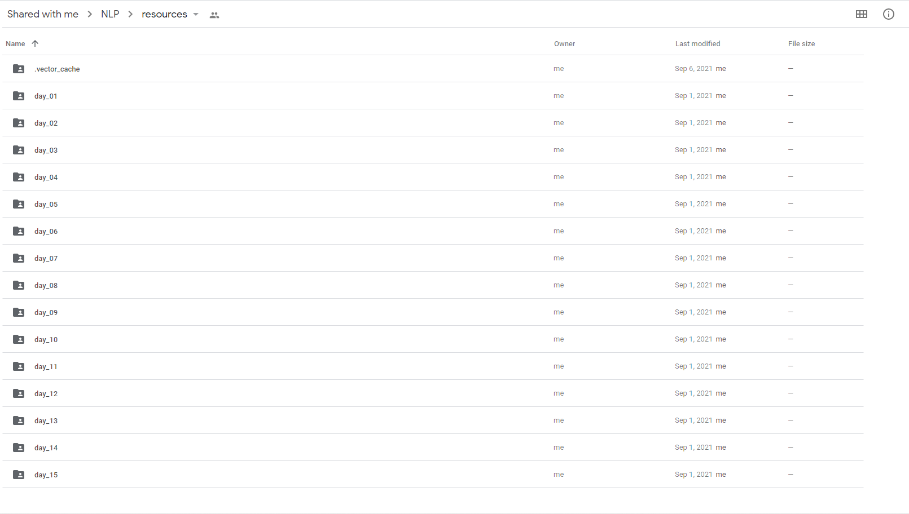

2. Download the whole folder as zip and save it into your local drive (make sure you know the file location).
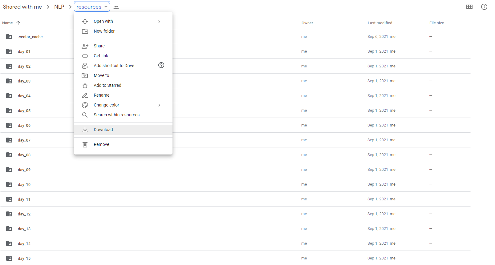

3. Use [WinRAR](https://www.win-rar.com/start.html?&L=0) or any other tools to unzip the `resources.zip` to your `nlp-traininglabs` root folder.

4. After finish the all the steps, your root folder should looks similar to this:
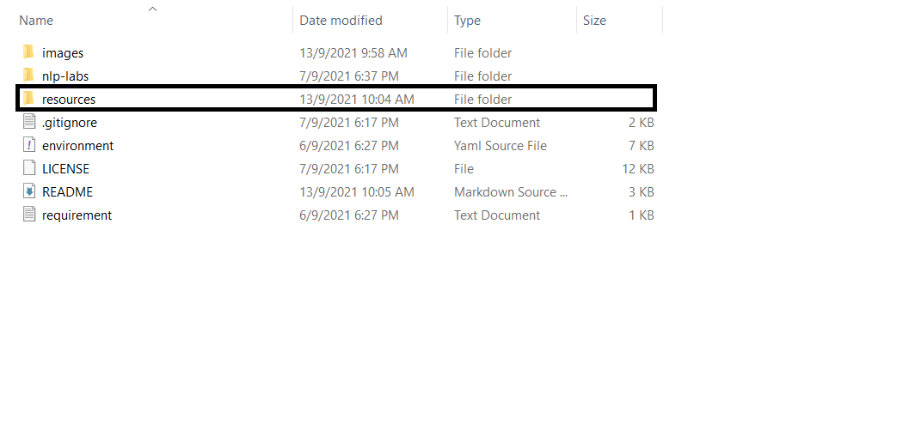